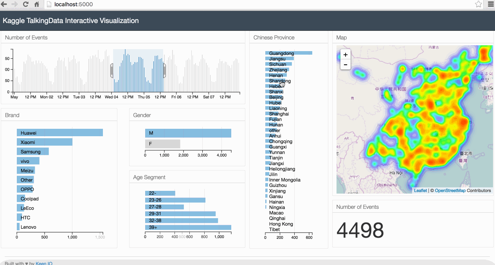

Source Code for my blog post: [Interactive Data Visualization of Geospatial Data using D3.js, DC.js, Leaflet.js and Python](http://adilmoujahid.com//posts/2016/08/interactive-data-visualization-geospatial-d3-dc-leaflet-python/)




#Dependencies

You need ```Python``` 2.7.x and 3 ```Python``` libraries: ```Pandas```, ```Flask```, ```Shapely```.

The easiest way to install ```Pandas``` is to install it as part of the [Anaconda distribution](https://www.continuum.io/downloads).

You can install ```Flask``` and ```Shapely``` using ```pip```.

```
pip install flask shapely
```

#How to run the code

1. Install all Python dependencies
2. Download the dataset (gender_age_train.csv, events.csv, phone_brand_device_model.csv) from [Kaggle](https://www.kaggle.com/c/talkingdata-mobile-user-demographics/data). You need to create a Kaggle account and agree to the competition rules to download the data.
3. Save the dataset in the ```input``` folder.
4. From the root folder, run ```python app.py```


#Visit my Blog : http://adilmoujahid.com
